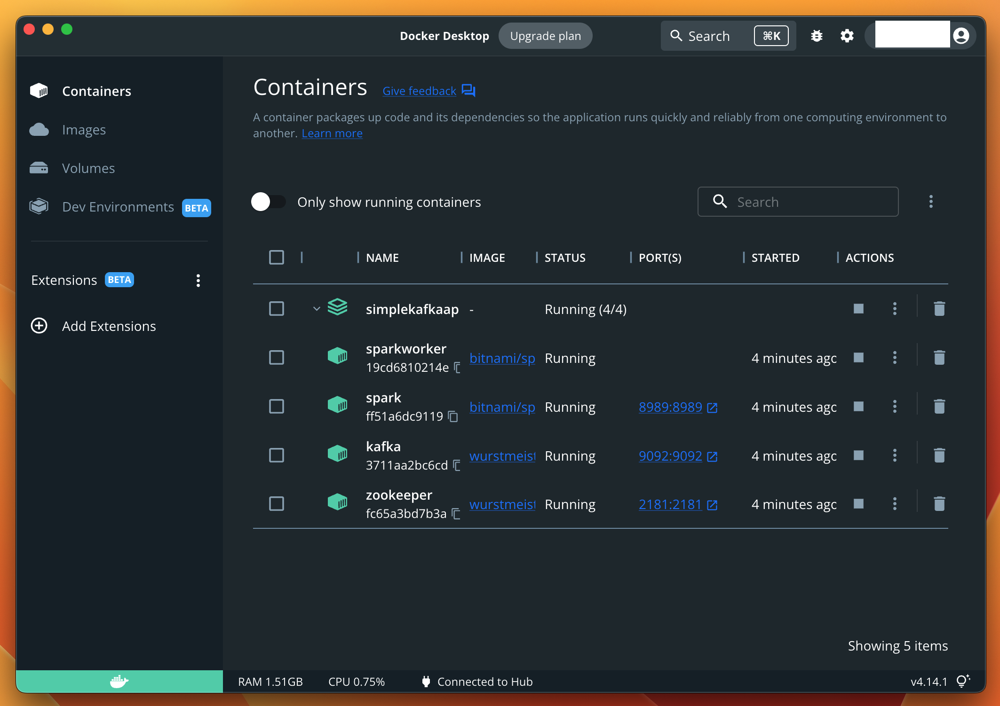
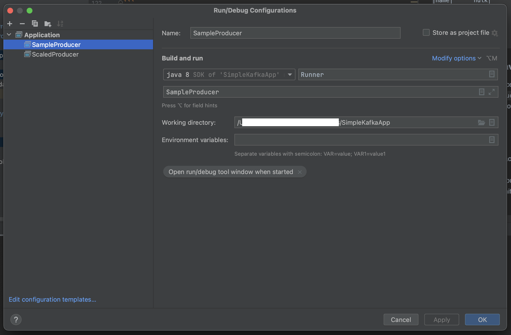
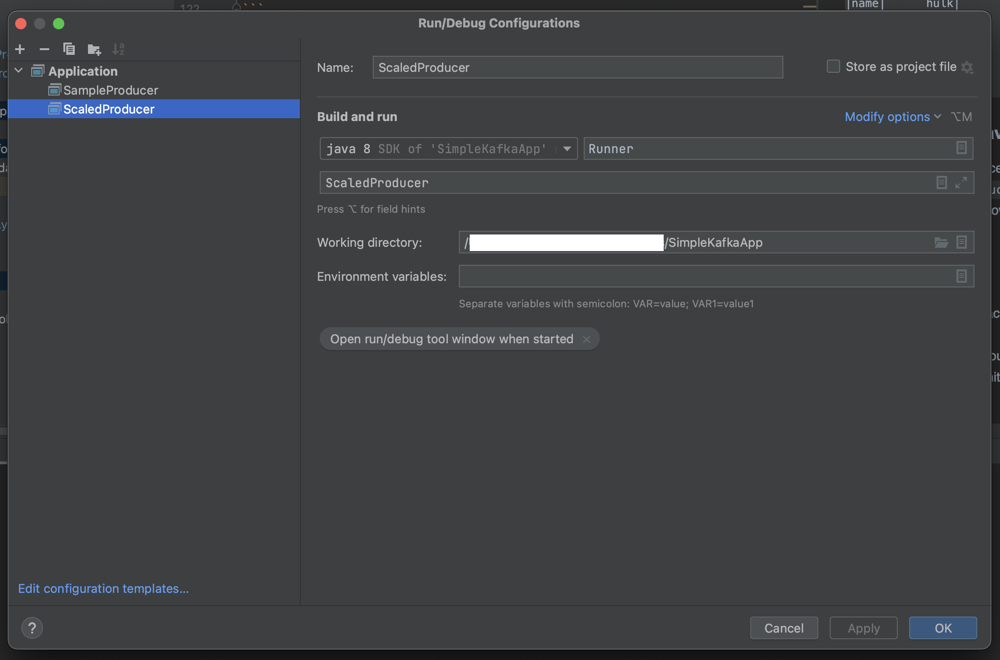

# SimpleKafkaApp

#### - WIP

## Prerequisites:
1. Basic knowledge of `docker` and how to use `docker-compose.yml` file
2. Install any <a href="https://en.wikipedia.org/wiki/Integrated_development_environment">IDE</a>. 
   I've used <a href="https://www.jetbrains.com/idea/download/#section=mac">IntelliJ</a>
3. Install `docker` and `docker-compose` on your device
4. Install XCode for setting up this repository on your machine 

## Setup
1. Clone this Repository on your local system
2. Assuming you are connected to a Mac System on a Secure `WiFi` connection, 
   find the IP Address of your Machine using this command:
```
$ ipconfig getifaddr en0
10.0.0.78
```
3. Replace `localhost` with the above Local IP Address in the following files:
```
a. docker-compose.yml
b. src/main/java/SampleProducer.java
c. src/main/java/ScaledProducer.java
d. src/main/python/pyspark_consumer.py
```
4. Open the Project in IntelliJ and Build it without failures
5. In Terminal, Create the Docker containers for the `zookeeper`, `kafka`, `spark`, `sparkworker`
```
$ docker-compose -f docker-compose.yml up
```
6. Now check the Docker Dashboard to check the containers that are created during the process

This can also be confirmed using the `docker ps` command

```
$ docker ps
CONTAINER ID   IMAGE                    COMMAND                  CREATED         STATUS         PORTS                                                NAMES
19cd6810214e   bitnami/spark:3.3        "/opt/bitnami/script…"   6 minutes ago   Up 6 minutes                                                        sparkworker
ff51a6dc9119   bitnami/spark:3.3        "/opt/bitnami/script…"   6 minutes ago   Up 6 minutes   0.0.0.0:8989->8989/tcp                               spark
3711aa2bc6cd   wurstmeister/kafka       "start-kafka.sh"         6 minutes ago   Up 6 minutes   0.0.0.0:9092->9092/tcp                               kafka
fc65a3bd7b3a   wurstmeister/zookeeper   "/bin/sh -c '/usr/sb…"   6 minutes ago   Up 6 minutes   22/tcp, 2888/tcp, 3888/tcp, 0.0.0.0:2181->2181/tcp   zookeeper
```

7. Now, we are ready to proceed to the implementation

## Implementation
### SampleProducer.java
Login in to the `kafka` container from our local machine:
```
$ docker exec -it kafka /bin/sh
```
Once there, navigate to the `/opt/kafka/bin` directory. It houses the scripts for Kafka Basic commands
```
# cd /opt/kafka/bin
```
There we can see all the topics mentioned in the `KAFKA_CREATE_TOPICS` tag in `docker-compose.yml`:
```
# ./kafka-topics.sh --list --zookeeper zookeeper:2181
mychannel1
topic1
```
We can initiate the `kafka` consumer to listen to `mychannel1` topic:
```
# ./kafka-console-consumer.sh --bootstrap-server localhost:9092 --topic mychannel1 --from-beginning
```
Add the configurations in `IntelliJ` to execute the `SampleProducer.java` App


Now run the Application.
<br />
In the Terminal Window where Kafka Consumer is listening to the `mychannel1` Topic:
```
# ./kafka-console-consumer.sh --bootstrap-server localhost:9092 --topic mychannel1 --from-beginning
ironman
thor
hulk
spiderman
blackwidow
gamura
```
This completes the Part 1. Now we want to consume this data using PySpark.
<br />
Lets login to the Spark Container from our local machine:
```
$ docker exec -it spark /bin/sh
```
While starting Pyspark, include the 
<a href="https://spark.apache.org/docs/latest/structured-streaming-kafka-integration.html#deploying">packages</a>
for kafka Streaming Integration in Pyspark Structured Streaming
```
$ pyspark --packages org.apache.spark:spark-sql-kafka-0-10_2.12:3.3.1
```
Next, execute the commands given in the `sample_pyspark_consumer.py`:
```
final_df.show()   # Gives us
+----+----------+                                                               
| key|     value|
+----+----------+
|name|   ironman|
|name|      thor|
|name|      hulk|
|name| spiderman|
|name|blackwidow|
|name|    gamura|
+----+----------+
```
### ScaledProducer.java
We follow the similar process, except that we run the `ScaledProducer.java` now.
<br />
Configurations for Running `ScaledProducer` are as follows:


And, in pyspark, we run the code in `scaled_pyspark_consumer.py`

## Wrapping up
It's a good practice to gracefully finishing what you started.
<br/>This is how we can stop our `Docker` containers to run till eternity from our local machine

```
$ docker-compose -f docker-compose.yml down 
[+] Running 5/4
 ⠿ Container sparkworker           Removed                    10.2s
 ⠿ Container spark                 Removed                    10.2s
 ⠿ Container zookeeper             Removed                    10.2s
 ⠿ Container kafka                 Removed                     4.3s
 ⠿ Network simplekafkaapp_default  Removed                     0.1s
```
<hr />

#### Happy Data Pipelining!!!

```docker exec -it kafka /bin/sh```
```docker exec -it spark /bin/sh```

```cd /opt/kafka/bin```

```./kafka-topics.sh --create --zookeeper zookeeper:2181 --replication-factor 1 --partitions 1 --topic mychannel1```
```./kafka-topics.sh --create --zookeeper zookeeper:2181 --replication-factor 1 --partitions 10 --topic topic1```
```./kafka-topics.sh --create --zookeeper zookeeper:2181 --replication-factor 1 --partitions 10 --topic topic2```

```./kafka-topics.sh --list --zookeeper zookeeper:2181```

```./kafka-console-consumer.sh --bootstrap-server localhost:9092 --topic mychannel1 --from-beginning```
```./kafka-console-consumer.sh --bootstrap-server localhost:9092 --topic topic1 --from-beginning```

```./kafka-topics.sh --zookeeper zookeeper:2181 --delete --topic mychannel1```
```./kafka-topics.sh --zookeeper zookeeper:2181 --delete --topic topic1```

```./kafka-console-producer.sh --topic mtchannel1 --broker-list localhost:9092```

```./kafka-console-consumer.sh --bootstrap-server localhost:9092 --topic topic1 --from-beginning | ./kafka-console-producer.sh --topic topic2 --broker-list localhost:9092```
<br />
Note: The number of partitions in both the source and destination topics needs to be the same

```./kafka-console-consumer.sh --bootstrap-server localhost:9092 --topic topic2 --from-beginning```
